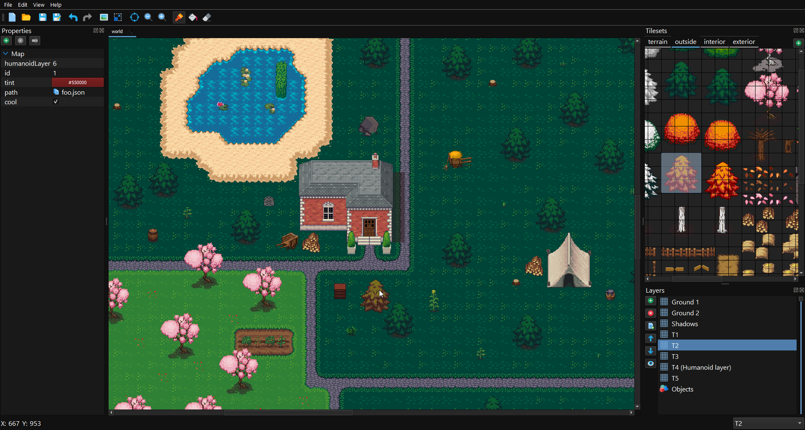

# tactile   

A tilemap editor that aims to be easy-to-use, fast and lightweight. Furthermore, compatibility with
the excellent [Tiled](https://www.mapeditor.org/) map editor is pursued.

## Aim

The following bullet points describe the goals that guide the design and development of the Tactile tilemap editor.

* Must be easy to learn and get started with.
* Must be easy to use.
* Keep things simple, hide advanced options that are rarely used.
* Well documented and high-quality source code.

## Source code

The Tactile application is written in C++20 using MSVC. At the time of writing, the code using features that are not yet available in stable releases of GCC and Clang, which means that Tactile is only available on Windows, for now. However, with time any C++20 compatible compiler should be able to build the sources.
